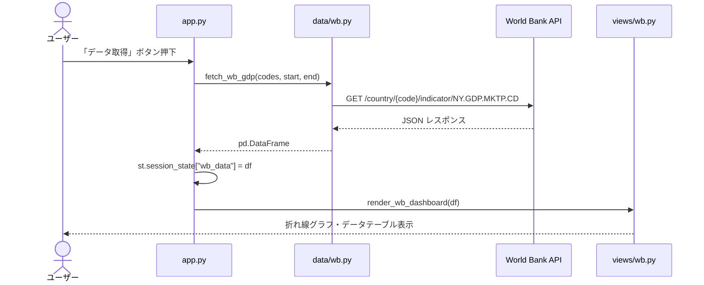
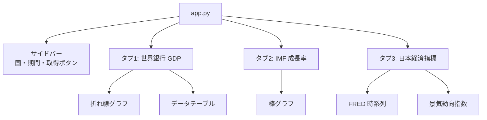

# AI Development Instructions — Streamlit Data Dashboard

> **For AI assistants**: GitHub Copilot, Cursor, Claude, ChatGPT, Gemini, and others.
> Follow every rule in this file precisely. If you are unsure, ask the developer before proceeding.
>
> **For beginners**: Every rule includes a "Why?" explanation. Read those before asking the AI to implement anything.

---

## 0. Core Philosophy

This project prioritizes **simplicity**, **maintainability**, **reproducibility**, and **security** in that order.

| Priority | Principle | Practical meaning |
|---|---|---|
| 1 | Simplicity | One file per concern. No unnecessary abstraction. |
| 2 | Maintainability | Each module has one job. Logic lives in one place only. |
| 3 | Reproducibility | Data fetching is always explicit. Results can be reproduced by re-running. |
| 4 | Security | API keys stay in `.env`. Never hardcode secrets. |

When these conflict, always choose the higher-priority value.

---

## 1. Technology Stack (DO NOT CHANGE)

| Category | Technology | Version | Why this choice |
|---|---|---|---|
| Language | Python | 3.10+ | Modern type hints, match statements, walrus operator |
| UI Framework | Streamlit | 1.40+ | Pure Python UI — no HTML/CSS/JS required |
| Data manipulation | pandas | 2.0+ | Industry-standard DataFrame library |
| Charting | Plotly | 5.20+ | Interactive charts; works natively in Streamlit |
| HTTP client | requests | 2.31+ | Simple, widely understood; no async complexity needed |
| Config | python-dotenv | 1.0+ | Keeps API keys out of source code |
| Package manager | uv | latest | Faster than pip; reproducible installs via `uv.lock` |
| E2E Testing | Playwright | 1.40+ | Headless browser; captures screenshots for verification |

### Non-negotiable constraints

- **Package manager**: `uv` only. Never use `pip`, `poetry`, or `pipenv`.
  > Why: `uv` produces a lockfile (`uv.lock`) that guarantees every developer installs the exact same versions. pip does not guarantee this.

- **UI**: Streamlit only. Never add React, Vue, Flask, or FastAPI to this project.
  > Why: Streamlit lets you build interactive data apps with pure Python. Adding another framework creates two conflicting web servers and doubles the complexity.

- **Charting**: Plotly only. Never mix in Matplotlib, Bokeh, or Altair.
  > Why: Plotly charts are interactive (zoom, hover, filter) and integrate natively with Streamlit via `st.plotly_chart()`. Mixing chart libraries produces inconsistent UX.

- **Data fetching**: `requests` only (synchronous). Never use `aiohttp` or `httpx` async in data modules.
  > Why: Streamlit runs in a synchronous context. Async HTTP calls require extra event-loop management that beginners find hard to debug.

- **Caching**: Always use `@st.cache_data` on data-fetching functions.
  > Why: Without caching, every user interaction re-fetches from the external API, making the app slow and potentially hitting rate limits.

---

## 2. Directory Structure

Every file has exactly one responsibility. Do not put logic where it does not belong.

```
project/
├── app.py                # ONLY: page setup, tab layout, top-level orchestration
├── config.py             # ONLY: constants, default values, API endpoint URLs
├── pyproject.toml        # dependency definitions
├── .env                  # NOT committed — contains API keys
├── .env.example          # Committed — shows required keys without values
├── .gitignore
│
├── data/                 # ONLY: fetch data from external APIs, return DataFrames
│   ├── __init__.py       # re-export all fetch functions
│   ├── worldbank.py      # World Bank API
│   ├── fred.py           # FRED (Federal Reserve) API
│   ├── estat.py          # e-Stat (Japan government statistics) API
│   └── {source}.py       # one file per data source
│
├── views/                # ONLY: Streamlit UI rendering (st.* calls live here)
│   ├── __init__.py       # re-export all render functions
│   ├── page_config.py    # st.set_page_config, CSS overrides
│   ├── sidebar.py        # st.sidebar widgets, return user inputs as dict
│   ├── components.py     # reusable UI fragments (charts, tables, placeholders)
│   ├── {topic}_tab.py    # one file per dashboard tab
│   └── ...
│
├── tests/
│   └── e2e/
│       └── test_app.py   # Playwright E2E tests (screenshot + assertion)
│
└── docs/
    ├── 01_要件定義.md     # what to build (required before coding)
    ├── 02_仕様書.md       # how to build it (data sources, screens, flows)
    ├── 03_テスト仕様書.md # how to verify it (test cases)
    └── 04_報告書.md       # results (test results, issues, deploy request)
```

### One-responsibility rule (enforce strictly)

| File/Folder | Allowed | Forbidden |
|---|---|---|
| `app.py` | page layout, tab creation, call `render_*` and `fetch_*` | business logic, chart creation, direct API calls |
| `config.py` | constants, default lists, API base URLs | computation, imports from `data/` or `views/` |
| `data/*.py` | API calls, JSON parsing, return `pd.DataFrame` | `st.*` calls, chart creation, global state |
| `views/*.py` | `st.*` calls, build charts, render tables | API calls, data transformation beyond display needs |
| `sidebar.py` | `st.sidebar.*` widgets, return `dict` of user inputs | data fetching, chart rendering |

---

## 3. Implementation Order (ALWAYS follow this sequence)

```
1. config.py   → define constants, API URLs, default values
      ↓
2. data/       → fetch functions that return DataFrames (one file per API source)
      ↓
3. views/      → render functions that display DataFrames as charts/tables
      ↓
4. app.py      → wire everything together (tabs, sidebar, data → view calls)
      ↓
5. tests/      → E2E tests with Playwright
      ↓
6. docs/       → spec and test report
```

> **Why this order?** `data/` functions define what data shape is available. `views/` functions consume that shape. If you write the view before knowing the DataFrame columns, you will rewrite the view when the data changes.

---

## 4. Coding Rules

### 4-1. data/ — Data Fetching

Every data-fetching function MUST follow this pattern:

```python
import pandas as pd
import requests
import streamlit as st
import logging

logger = logging.getLogger(__name__)

# REQUIRED: cache all data-fetching functions
@st.cache_data(ttl=3600)  # cache for 1 hour — adjust per API rate limits
def fetch_worldbank_gdp(country_codes: tuple[str, ...], start_year: int, end_year: int) -> pd.DataFrame:
    """
    Returns a DataFrame with columns: country, year, gdp_usd
    Returns an empty DataFrame on error — never raise to the caller.
    """
    url = f"https://api.worldbank.org/v2/country/{';'.join(country_codes)}/indicator/NY.GDP.MKTP.CD"
    params = {"format": "json", "per_page": 500, "mrv": end_year - start_year + 1}

    try:
        resp = requests.get(url, params=params, timeout=10)
        resp.raise_for_status()
        data = resp.json()
        # ... parse and return DataFrame
        return pd.DataFrame(rows, columns=["country", "year", "gdp_usd"])
    except requests.exceptions.Timeout:
        logger.warning("World Bank API timed out")
        return pd.DataFrame()       # empty DataFrame — view must handle this case
    except requests.exceptions.RequestException as e:
        logger.error("World Bank API error: %s", e)
        return pd.DataFrame()
    except (KeyError, IndexError, ValueError) as e:
        logger.error("World Bank response parse error: %s", e)
        return pd.DataFrame()
```

**REQUIRED patterns in data/:**
- `@st.cache_data(ttl=...)` on EVERY fetch function — no exceptions
- Arguments must be hashable (`tuple`, `str`, `int`, `bool`) — NOT `list` or `dict`
  > Why: `st.cache_data` uses arguments as cache keys. Lists and dicts are unhashable and will raise `UnhashableTypeError`.
- Always return `pd.DataFrame()` (empty) on error — never raise to the view layer
- Always set `timeout=` on every `requests.get()` call
  > Why: Without a timeout, a slow or unresponsive API will freeze the entire Streamlit app for all users.
- Use `logger.warning()` / `logger.error()` — never `print()`

**FORBIDDEN in data/:**
- `st.*` calls of any kind (no `st.error()`, `st.spinner()`, `st.write()`)
- `requests.get(url)` without `timeout=`
- Returning `None` — always return an empty DataFrame so views can safely call `.empty`
- Hardcoded API keys — always read from `os.environ` or `st.secrets`

---

### 4-2. views/ — UI Rendering

Every render function MUST handle empty data gracefully:

```python
import pandas as pd
import plotly.express as px
import streamlit as st

def render_gdp_chart(df: pd.DataFrame, title: str = "GDP Comparison") -> None:
    # ALWAYS check for empty data first
    if df.empty:
        st.warning("データを取得できませんでした。APIの状態を確認するか、条件を変えて再試行してください。")
        return

    fig = px.line(
        df,
        x="year",
        y="gdp_usd",
        color="country",
        title=title,
        labels={"gdp_usd": "GDP (USD)", "year": "Year", "country": "Country"},
    )
    fig.update_layout(
        hovermode="x unified",
        legend=dict(orientation="h", yanchor="bottom", y=1.02),
    )
    st.plotly_chart(fig, use_container_width=True)  # ALWAYS use_container_width=True


def render_data_table(df: pd.DataFrame, caption: str = "") -> None:
    if df.empty:
        return
    if caption:
        st.caption(caption)
    st.dataframe(df, use_container_width=True, hide_index=True)
```

**REQUIRED patterns in views/:**
- Check `df.empty` before every chart or table render
- `use_container_width=True` on all `st.plotly_chart()` and `st.dataframe()` calls
  > Why: Without this, charts use a fixed narrow width that looks broken on wide screens.
- Show a human-readable `st.warning()` when data is empty — never show a raw error

**FORBIDDEN in views/:**
- `requests.get()` or any direct API calls — data comes from `data/` only
- `st.cache_data` decorators — caching belongs in `data/`
- `st.set_page_config()` — belongs only in `views/page_config.py`
  > Why: `set_page_config` must be the very first Streamlit call. Calling it anywhere else raises a `StreamlitAPIException`.

---

### 4-3. sidebar.py — User Inputs

The sidebar collects all user input and returns it as a single `dict`. Nothing else.

```python
import streamlit as st

def render_sidebar() -> dict:
    """Render sidebar widgets and return all user inputs as a flat dict."""
    with st.sidebar:
        st.header("設定")

        countries = st.multiselect(
            "国を選択",
            options=["Japan", "USA", "China", "Germany"],
            default=["Japan", "USA"],
        )
        start_year, end_year = st.slider(
            "期間",
            min_value=2000,
            max_value=2024,
            value=(2010, 2023),
        )
        execute = st.button("データ取得", type="primary")

    return {
        "countries": countries,
        "start_year": start_year,
        "end_year": end_year,
        "execute": execute,
    }
```

**Why return a dict?** `app.py` can pass the whole dict around without knowing which widget produced each value. Adding a new widget only requires adding a key to the dict — no changes to `app.py` signatures.

---

### 4-4. app.py — Top-Level Orchestration

`app.py` is the entry point. It wires together config → sidebar → data → view. No logic lives here.

```python
from __future__ import annotations
from pathlib import Path
import streamlit as st
from dotenv import load_dotenv

load_dotenv(Path(__file__).parent / ".env")

from config import WB_COUNTRIES          # noqa: E402
from data import fetch_worldbank_gdp     # noqa: E402
from views import setup_page, render_sidebar, render_gdp_chart  # noqa: E402

def main() -> None:
    setup_page()
    st.title("各国 GDP 比較ダッシュボード")

    inputs = render_sidebar()

    tab1, tab2 = st.tabs(["世界銀行", "IMF"])

    with tab1:
        if inputs["execute"]:
            if not inputs["countries"]:
                st.warning("国を1つ以上選択してください。")
            else:
                codes = tuple(WB_COUNTRIES[n] for n in inputs["countries"])
                with st.spinner("データ取得中..."):
                    df = fetch_worldbank_gdp(codes, inputs["start_year"], inputs["end_year"])
                render_gdp_chart(df)

if __name__ == "__main__":
    main()
```

**FORBIDDEN in app.py:**
- Direct `requests.get()` calls
- Chart creation (`px.line()`, `go.Figure()`)
- Long data transformation logic — keep it under 5 lines per tab

---

### 4-5. config.py — Constants Only

```python
# config.py — constants and defaults only. No computation, no imports from data/ or views/.

WB_COUNTRIES: dict[str, str] = {
    "日本": "JPN",
    "アメリカ": "USA",
    "中国": "CHN",
    "ドイツ": "DEU",
}

WB_INDICATOR_GDP = "NY.GDP.MKTP.CD"

FRED_SERIES: dict[str, str] = {
    "US GDP": "GDP",
    "US Unemployment": "UNRATE",
}

IMF_DEFAULTS = {
    "indicator": "NGDP_RPCH",   # Real GDP growth
    "start_year": 2010,
    "end_year": 2023,
}
```

**FORBIDDEN in config.py:**
- Function definitions
- `import requests`, `import pandas`, `import streamlit`
- Any computation or I/O

---

## 5. Error Handling

### Data layer — always return empty DataFrame

```python
# In data/*.py — NEVER let exceptions escape to the view layer
try:
    resp = requests.get(url, timeout=10)
    resp.raise_for_status()
    return _parse(resp.json())
except requests.exceptions.Timeout:
    logger.warning("API timeout: %s", url)
    return pd.DataFrame()
except requests.exceptions.HTTPError as e:
    logger.error("HTTP %s from %s", e.response.status_code, url)
    return pd.DataFrame()
except Exception as e:
    logger.exception("Unexpected error fetching %s", url)
    return pd.DataFrame()
```

### View layer — always check before rendering

```python
# In views/*.py
def render_chart(df: pd.DataFrame) -> None:
    if df.empty:
        st.info("データがありません。条件を変えて「データ取得」を押してください。")
        return
    # ... render chart
```

### User-facing messages

| Situation | Message style | Example |
|---|---|---|
| Empty result | `st.info()` — neutral | "データがありません。期間や国の条件を変えてください。" |
| API error | `st.warning()` — caution | "データを取得できませんでした。しばらく待って再試行してください。" |
| User input missing | `st.warning()` | "国を1つ以上選択してください。" |
| Unexpected error | `st.error()` — serious | "予期しないエラーが発生しました。開発者に連絡してください。" |

**FORBIDDEN:**
- `st.error(str(e))` — never show Python exception messages to users
- `raise` from view functions — let the UI handle all errors gracefully

---

## 6. Security Rules

### API keys and secrets

```
✅ Store ALL API keys in .env — never hardcode in source files
✅ Read keys via os.environ.get("KEY") or st.secrets["KEY"]
✅ .env must be in .gitignore before the first git add
✅ Provide .env.example with placeholder values (never real keys)
✅ Never log API key values, even at DEBUG level
```

### Required .gitignore entries (must exist before first `git add`)

```gitignore
# Secrets
.env

# Data cache files
*.csv
*.json
*.parquet

# Python cache
__pycache__/
*.pyc
*.pyo

# Virtual environment
.venv/
venv/

# OS files
.DS_Store
Thumbs.db

# IDE
.vscode/
.idea/

# Streamlit cache
.streamlit/
```

### Required .env.example (commit this — it is the template, not the secret)

```env
# FRED API key (get one free at https://fred.stlouisfed.org/docs/api/api_key.html)
FRED_API_KEY=your_key_here

# e-Stat API key (get one at https://www.e-stat.go.jp/api/)
ESTAT_APP_ID=your_app_id_here

# Add other API keys below
```

---

## 7. Logging

```python
import logging

# In each module — one logger per file
logger = logging.getLogger(__name__)

# In app.py — configure once at startup
logging.basicConfig(
    level=logging.INFO,
    format="%(asctime)s %(levelname)s %(name)s: %(message)s",
)

# Usage
logger.info("Fetching World Bank data for %d countries", len(country_codes))
logger.warning("World Bank returned empty response for %s", country_codes)
logger.error("FRED API error: status=%d", resp.status_code)
logger.exception("Unexpected parse error")   # includes full traceback

# FORBIDDEN
logger.debug("API key: %s", api_key)   # never log secrets
print("debug:", df)                     # never use print — use logger
```

---

## 8. Caching Strategy

Streamlit reruns the entire script on every user interaction. Without caching, every click re-fetches from the API.

```python
# Short TTL for frequently-updated data
@st.cache_data(ttl=600)       # 10 minutes — daily-updated indicators
def fetch_fred_series(...): ...

# Long TTL for stable data
@st.cache_data(ttl=86400)     # 24 hours — historical GDP figures
def fetch_worldbank_gdp(...): ...

# Clear cache manually when needed
if st.button("キャッシュをクリア"):
    st.cache_data.clear()
    st.rerun()

# REQUIRED: use tuple, not list, for collection arguments
# ✅ Correct — tuple is hashable
def fetch_gdp(country_codes: tuple[str, ...], ...): ...

# ❌ Wrong — list is not hashable, raises UnhashableTypeError
def fetch_gdp(country_codes: list[str], ...): ...
```

---

## 9. Testing Rules

### Core principles

```
✅ E2E tests use Playwright to launch the real Streamlit app
✅ Tests capture screenshots for visual verification
✅ Each test is independent — do not share session state between tests
✅ Tests must pass before declaring any feature complete
```

### E2E test pattern

```python
# tests/e2e/test_app.py
import pytest
from playwright.sync_api import Page, expect

BASE_URL = "http://localhost:8501"

def test_page_loads(page: Page):
    page.goto(BASE_URL)
    expect(page).to_have_title("Streamlit")
    expect(page.get_by_text("GDP")).to_be_visible()

def test_fetch_worldbank(page: Page):
    page.goto(BASE_URL)
    page.get_by_text("データ取得").click()
    # Wait for chart or warning to appear
    page.wait_for_selector(".stPlotlyChart, .stAlert", timeout=15000)
    page.screenshot(path="tests/e2e/screenshots/worldbank.png")

def test_empty_country_shows_warning(page: Page):
    page.goto(BASE_URL)
    # Deselect all countries, then click fetch
    page.get_by_text("データ取得").click()
    expect(page.get_by_text("国を1つ以上選択")).to_be_visible()
```

### Running tests

```bash
# Start the app first (in a separate terminal)
uv run streamlit run app.py

# Install browsers (first time only)
uv run playwright install chromium

# Run E2E tests
uv run pytest tests/e2e/ -v

# Run with screenshot on failure
uv run pytest tests/e2e/ -v --screenshot=on
```

---

## 10. Documentation Rules

> **Documentation is not optional.** Every project MUST maintain the four documents below.
> An undocumented system cannot be handed over, audited, or approved by an IT department.

### Required header for every document

```markdown
| Field | Value |
|---|---|
| Created | YYYY-MM-DD |
| Last Updated | YYYY-MM-DD |
| Version | v1.0 |
| Author | Name |
```

Version rules:
- Start at `v1.0`
- Increment to `v1.1`, `v1.2` for additions and fixes
- Jump to `v2.0` for major structural changes
- **Update "Last Updated" and the version number every time the file changes — no exceptions**

### Mandatory documents (all four MUST exist before release)

| File | When to create | When to update | Content |
|---|---|---|---|
| `docs/01_要件定義.md` | Before writing any code | When scope, requirements, or data sources change | Purpose, target users, required charts/indicators, data sources |
| `docs/02_仕様書.md` | After requirements confirmed | When screens, data sources, or configs change | Screen layout, data source specs, API list, config keys |
| `docs/03_テスト仕様書.md` | Before writing tests | When test cases are added or changed | Test policy, E2E test cases, expected behavior |
| `docs/04_報告書.md` | After tests pass | When test results, issues, or deploy info changes | Test results, issue list, deliverables, deployment request |
| `README.md` | After implementation | When setup steps or launch commands change | Setup, launch, API key acquisition, test commands |

### When the AI must prompt the user to update documents

The AI **must proactively remind** the user to update documentation in these situations:

```
✅ After adding a new data source (new file in data/)  → update 02_仕様書.md
✅ After adding or changing a tab or chart             → update 02_仕様書.md (screen spec)
✅ After adding a new config constant or .env key      → update 02_仕様書.md + .env.example
✅ After adding a new test case                        → update 03_テスト仕様書.md
✅ After running tests                                 → update 04_報告書.md (test results)
✅ After fixing a bug found in testing                 → update 04_報告書.md (bug list)
✅ After changing startup or setup commands            → update README.md
```

**Reminder phrasing to use:**
> "A new data source was added. Please update `docs/02_仕様書.md` (data source section) and `.env.example` if a new API key is required, then increment the version to v1.x."

### Use Mermaid to make documents visual

Every document that describes structure, flow, or relationships **must include at least one Mermaid diagram**.
Plain prose alone is not sufficient — diagrams reduce misunderstanding and speed up review.

#### Required diagrams by document

| Document | Required Mermaid diagram | Diagram type |
|---|---|---|
| `02_仕様書.md` | Data fetch flow (UI → data/ → API → DataFrame) | `sequenceDiagram` |
| `02_仕様書.md` | Tab and screen layout | `flowchart TD` |
| `01_要件定義.md` | Business flow (purpose → data source → output) | `flowchart LR` |
| `04_報告書.md` | Component dependency map | `flowchart LR` |

#### Sequence diagram — data fetch flow

````markdown

````

#### Flowchart — screen layout and tab structure

````markdown

````

#### Flowchart — data architecture

````markdown
```mermaid
flowchart LR
    subgraph data ["data/ — API呼び出し専用"]
        WB[fetch_wb_gdp]
        IMF[fetch_imf_gdp_growth]
        FRED[fetch_fred_series]
    end
    subgraph views ["views/ — 描画専用"]
        V1[render_wb_dashboard]
        V2[render_imf_dashboard]
        V3[render_japan_dashboard]
    end
    WB -->|pd.DataFrame| V1
    IMF -->|pd.DataFrame| V2
    FRED -->|pd.DataFrame| V3
    WB -.->|@st.cache_data| WB
    IMF -.->|@st.cache_data| IMF
    FRED -.->|@st.cache_data| FRED
```
````

**AI instructions for Mermaid:**

- When writing or updating `02_仕様書.md`, always include a `sequenceDiagram` showing how data flows from button click → `data/` function → external API → DataFrame → `views/` render.
- When a new data source or tab is added, **update the flowchart immediately** in the same response.
- When writing `01_要件定義.md`, include a `flowchart LR` showing the purpose (e.g., "比較したい") → data source → chart output.
- Never describe a flow or architecture in prose only — add a diagram.
- Use Japanese labels inside diagrams to match the audience.

### Required README.md sections

1. One-paragraph overview of what the dashboard shows
2. Requirements (Python 3.10+, uv)
3. API key setup (where to get each key, which `.env` variable to set)
4. Setup: `cp .env.example .env` → fill in keys → `uv sync` → launch
5. How to launch: `uv run streamlit run app.py`
6. How to run E2E tests
7. How to clear the data cache

---

## 11. Rules for AI Assistants

These rules exist to protect beginners from irreversible mistakes and ensure consistent, reviewable progress.

### Behavior rules — mandatory

1. **Follow the implementation order** (config → data → views → app → tests → docs).
   Never jump ahead. If the user asks to skip a step, explain why the order matters.

2. **Never add libraries or tools not listed in section 1.**
   If you believe an addition is necessary, state: "I recommend adding X because Y. Shall I proceed?"

3. **After writing code, always provide the command to verify it.**
   Example: `uv run streamlit run app.py` then open `http://localhost:8501`.

4. **Before fixing a bug, explain the cause.**
   State the file, line number, and reason. Then ask permission to fix.

5. **Before deleting or renaming any file, ask explicitly.**
   Example: "I need to rename `views/imf_tab.py` to `views/imf.py`. Is that OK?"

6. **Never output, log, or display `.env` file contents.**

7. **Never run `git commit` or `git push` without explicit user instruction.**

8. **Never say "it's done" without evidence.**
   Accepted evidence: Streamlit app launches without error, chart is visible in the browser, or E2E test passes.

9. **Before modifying existing code, state the reason.**
   "I'm changing X in `data/worldbank.py` because Y. The affected lines are Z."

10. **When a beginner asks "why?", always explain the concept before implementing.**
    Do not just write code. Explain the tradeoff in plain language first.

11. **Generate one layer at a time.**
    Do not write data/ + views/ + app.py in one response. Complete and confirm each layer.

12. **Documents must be created and kept up to date — always remind the user.**
    - At the start of a new project: "Please fill in `docs/01_要件定義.md` before we write any code."
    - After every data source, screen, or config change: remind the user which doc section to update (see section 10).
    - At the end of testing: "Please record the test results in `docs/04_報告書.md`."
    - Never declare a feature complete if the relevant documentation is still a placeholder.

13. **Before any large change, recommend a git commit checkpoint.**
    A "large change" means: adding a new data source, adding a new tab, refactoring a module,
    or any change that touches more than two files.
    Use this exact phrasing:

    > "Before we make this change, I recommend saving your current progress:
    > ```
    > git add {list the specific files}
    > git commit -m "chore: checkpoint before {brief description of upcoming change}"
    > ```
    > This way you can easily revert if something goes wrong. Ready to proceed?"

    Wait for the user to confirm before starting the change.

### Recommended conversation flow

```
Step 1 — Fill in requirements (BEFORE writing any code)
  "Here is my idea: [what data, what charts, which APIs]"
  → AI helps fill in docs/01_要件定義.md
  → AI creates docs/02_仕様書.md (data sources, screen layout, API list)

Step 2 — Review spec
  "Review the spec. Are there any issues?"
  → AI checks for missing API keys, ambiguous chart types, performance risks
  → User confirms → git commit: "docs: add requirements and spec"

Step 3 — Implement layer by layer
  [AI prompts a git commit before each layer if previous layer changed files]
  "Create config.py"                → AI writes + explains
  "Create data/worldbank.py"        → AI writes + explains → remind to update 02_仕様書.md
  "Create views/worldbank_tab.py"   → AI writes + explains → remind to update 02_仕様書.md
  "Wire it into app.py"             → AI writes + explains

Step 4 — Verify
  "Start the app and show me how to verify it works"
  → git commit: "feat: add {data source} tab"

Step 5 — Test
  "Create the test spec and write E2E tests"
  → AI helps fill in docs/03_テスト仕様書.md
  → AI writes Playwright tests and runs them
  → AI reminds user to fill in docs/04_報告書.md with results
  → git commit: "test: add E2E tests for {feature}"

Step 6 — Complete documentation
  "Update README.md and docs/04_報告書.md"
  → git commit: "docs: finalize test report and README"

Step 7 — Before any new data source or refactor
  → AI recommends: "git add + git commit before we start, so you have a safe restore point"
```

---

## 12. Common Mistakes (Beginner Reference)

These mistakes appear frequently. The AI must actively prevent them.

| Mistake | Symptom | Correct approach |
|---|---|---|
| `st.*` calls in `data/` | `StreamlitAPIException` or mixed concerns | Move all `st.*` to `views/`; `data/` only returns DataFrames |
| No `@st.cache_data` | App re-fetches on every click; slow; hits rate limits | Add `@st.cache_data(ttl=...)` to every fetch function |
| `list` argument to cached function | `UnhashableTypeError` at runtime | Use `tuple` instead of `list` for collection arguments |
| No `timeout=` on `requests.get()` | App freezes when API is slow or down | Always set `timeout=10` (or appropriate value) |
| Returning `None` on API error | `AttributeError: 'NoneType' has no attribute 'empty'` in view | Always return `pd.DataFrame()` on error |
| `st.set_page_config()` not first | `StreamlitAPIException: set_page_config() can only be called once` | Call it in `setup_page()` before any other `st.*` call |
| Hardcoded API key | Key exposed in git history | Always use `.env` + `os.environ.get()` |
| No empty-data check in views | `ValueError` or blank chart with no explanation | Always check `if df.empty:` before rendering |
| `st.error(str(e))` to user | Raw Python exception visible to users | Show a human-readable message; log the exception internally |
| Secrets in source code | Credentials exposed in git history | Always use `.env` |
| Missing `.env.example` | New developers cannot run the app | Always commit `.env.example` with placeholder values |

---

## 13. Common Commands

```bash
# Install dependencies
uv sync

# Start the app (development)
uv run streamlit run app.py

# Start on a different port
uv run streamlit run app.py --server.port 8502

# Install Playwright browsers (first time only)
uv run playwright install chromium

# Run E2E tests (start app first in a separate terminal)
uv run pytest tests/e2e/ -v
uv run pytest tests/e2e/ -v --screenshot=on   # save screenshots

# Type checking (optional but recommended)
uv run mypy app.py data/ views/

# Commit (only when explicitly instructed)
git add {specific files}    # never use git add . blindly
git commit -m "message"
git push
```
