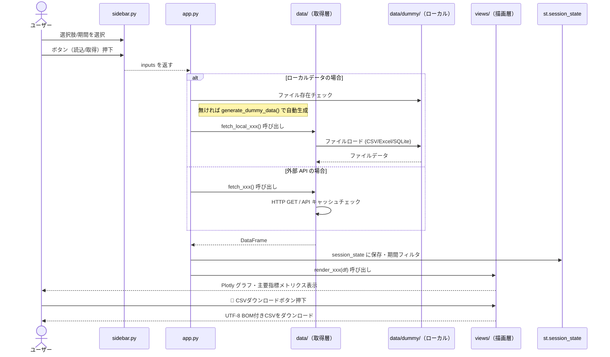

# 各国GDP比較ダッシュボード — 仕様書

## 1. 概要

世界銀行（World Bank）や IMF などの外部 API データに加え、ローカルのファイルやデータベース（CSV、Excel、SQLite）を含む多様なデータソースからデータを取得し、各国のGDPおよび関連指標を可視化・比較するStreamlitダッシュボード。
開発フレームワークとしてのデータソース対応力を示すデモアプリとして機能し、以下の6つのタブを搭載しています。

| タブ | データソース | 指標・特徴 |
|---|---|---|
| 🌍 世界銀行 GDP | World Bank API v2 | GDP（米ドル建て）`NY.GDP.MKTP.CD` |
| 📈 IMF GDP成長率 | World Bank API v2 | 実質GDP成長率 `NY.GDP.MKTP.KD.ZG`（0%基準線付き） |
| 🇯🇵 日本経済指標 | FRED / e-Stat | 鉱工業生産・失業率・CPI・景気動向指数 |
| 📁 CSVデータ (ローカル) | ローカル CSV ファイル | 積層エリアチャートによる可視化（カナダ・ブラジル・韓国） |
| 🗄️ SQLiteデータ (ローカル) | ローカル SQLite DB | グループ棒グラフによる可視化（イギリス・フランス・イタリア） |
| 📊 Excelデータ (ローカル) | ローカル Excel ファイル | 折れ線グラフによる可視化（オーストラリア・インド・ドイツ） |

また、本プロジェクトはローカルでのWebサーバー起動に加え、**Windows用スタンドアロンEXE（実行ファイル）**としてのビルドにも対応しています。

---

## 2. 技術スタック

| 項目 | 技術 | 目的 |
|---|---|---|
| 言語 | Python 3.10+ | 基本開発言語 |
| フレームワーク | Streamlit | UI・ダッシュボード構築 |
| データ取得/解析 | `requests` / `pandas` | API 接続およびデータ加工 |
| Excel 解析 | `openpyxl` | ローカル Excel ファイルの読み込み |
| データベース | `sqlite3` (標準ライブラリ) | ローカル SQLite DB への接続・クエリ実行 |
| 可視化 | `plotly` | インタラクティブなグラフ描画 |
| パッケージ管理 | `uv` + `pyproject.toml` | 仮想環境（`.venv`）および高速なパッケージ同期 |
| EXE化ツール | `pyinstaller` | ポータブルな配布用実行ファイル（EXE）のコンパイル |
| セキュリティ検査 | `pip-audit` / `Bandit` | 依存ライブラリの脆弱性診断および静的コードセキュリティスキャン |

---

## 3. システム構成（アーキテクチャ）

### 3.1 ディレクトリ構成

```text
gdp-dashboard/
├── app.py                  # エントリーポイント・タブ制御・セッション管理
├── launcher.py             # EXE 起動用ラッパー（Streamlitのプログラム起動 & ブラウザ自動表示）
├── build.bat               # EXE ビルド用バッチファイル（PyInstaller呼び出し定義）
├── logger_config.py        # アプリ全体のロギング一元設定（stderr出力 + UTF-8ログ書き出し）
├── generate_dummy_data.py  # ローカルデモ用のダミーデータ（CSV/Excel/SQLite）作成スクリプト
├── config.py               # 全定数・マスターデータ（国コード・カラー）
├── pyproject.toml          # 依存パッケージ定義（uv管理）
├── .env                    # APIキー（FRED / e-Stat）の格納用
├── data/                   # データ取得層（UI・Streamlit描画ロジックは含めない）
│   ├── __init__.py
│   ├── worldbank.py        # 世界銀行 GDP / IMF GDP 成長率
│   ├── fred.py             # FRED 経済指標
│   ├── estat.py            # e-Stat 景気指標
│   ├── local_csv.py        # ローカル CSV ファイル読み込み
│   ├── local_excel.py      # ローカル Excel ファイル読み込み
│   ├── local_sqlite.py     # ローカル SQLite データベース読み込み
│   └── dummy/              # 自動生成されるデモ用ダミーデータ配置先
│       ├── gdp_data.csv
│       ├── gdp_data.xlsx
│       └── gdp_data.sqlite
├── views/                  # UI描画層（データの取得・永続化処理は含めない）
│   ├── __init__.py
│   ├── page_config.py      # ページ初期化・グローバルCSS
│   ├── sidebar.py          # サイドバー UI と入力値返却
│   ├── components.py       # 共通UI部品（CSVダウンロードボタン・テーブルなど）
│   ├── worldbank_tab.py    # 世界銀行 GDP 画面
│   ├── imf_tab.py          # IMF GDP 成長率画面
│   ├── japan_tab.py        # 日本経済指標画面
│   ├── local_csv_tab.py    # ローカル CSV 可視化画面
│   ├── local_sqlite_tab.py # ローカル SQLite 可視化画面
│   └── local_excel_tab.py  # ローカル Excel 可視化画面
└── docs/                   # プロジェクト資料・ドキュメント類
    ├── spec.md             # 本仕様書
    ├── implementation_plan.md # 開発統合計画書
    ├── task.md             # タスクチェックリスト
    ├── walkthrough.md      # 検証実績報告書
    └── AI_Python_製造業分析フレームワーク_EUC向け.md # AI×Python 製造業分析ガイド（EUC向け）
```

---

### 3.2 モジュール関係図

```mermaid
graph TD
    app["app.py\nエントリーポイント"]
    config["config.py\n定数・マスターデータ"]
    gen["generate_dummy_data.py\nダミーデータ生成スクリプト"]

    subgraph data["data/ — データ取得層"]
        wb["worldbank.py\nfetch_wb_gdp\nfetch_imf_gdp_growth"]
        fred["fred.py\nfetch_fred_series"]
        estat["estat.py\nfetch_estat_ci"]
        csv["local_csv.py\nfetch_local_csv"]
        excel["local_excel.py\nfetch_local_excel"]
        sqlite["local_sqlite.py\nfetch_local_sqlite"]
    end

    subgraph views["views/ — UI描画層"]
        pc["page_config.py\nsetup_page"]
        sb["sidebar.py\nrender_sidebar"]
        comp["components.py\nCSVボタン・テーブル"]
        wbt["worldbank_tab.py\nrender_wb_dashboard"]
        imft["imf_tab.py\nrender_imf_dashboard"]
        jpt["japan_tab.py\nrender_japan_dashboard"]
        csvt["local_csv_tab.py\nrender_local_csv"]
        excelt["local_excel_tab.py\nrender_local_excel"]
        sqlitet["local_sqlite_tab.py\nrender_local_sqlite"]
    end

    subgraph external["データソース"]
        wbapi["World Bank API v2"]
        fredapi["FRED API"]
        estatapi["e-Stat API"]
        local_files["ローカルファイル・DB\n(data/dummy/)"]
    end

    app --> config
    app --> wb
    app --> fred
    app --> estat
    app --> csv
    app --> excel
    app --> sqlite
    app --> pc
    app --> sb
    app --> wbt
    app --> imft
    app --> jpt
    app --> csvt
    app --> excelt
    app --> sqlitet
    
    app -.-> gen

    wb --> config
    fred --> config
    estat --> config
    csv --> local_files
    excel --> local_files
    sqlite --> local_files

    wbt --> comp
    imft --> comp
    jpt --> comp
    csvt --> comp
    excelt --> comp
    sqlitet --> comp
    
    wbt --> config
    imft --> config
    jpt --> config
    csvt --> config
    excelt --> config
    sqlitet --> config
    sb --> config

    wb --> wbapi
    fred --> fredapi
    estat --> estatapi
```



---

### 3.3 処理フロー概要



---

### 3.4 データキャッシュ戦略

Streamlit のメモリキャッシュ機能を利用し、データソースへの無駄なリクエストやファイル IO を軽減します。

| 関数 | キャッシュデコレータ | TTL | キャッシュキー |
|---|---|---|---|
| `fetch_wb_gdp` | `@st.cache_data` | 24時間 | 国コード・期間 |
| `fetch_imf_gdp_growth` | `@st.cache_data` | 24時間 | 国コード・期間 |
| `fetch_fred_series` | `@st.cache_data` | 24時間 | FRED シリーズID・期間 |
| `fetch_estat_ci` | `@st.cache_data` | 24時間 | 引数なし（固定キャッシュ） |
| `fetch_local_csv` | `@st.cache_data` | 1時間 | ファイルパス |
| `fetch_local_excel` | `@st.cache_data` | 1時間 | ファイルパス |
| `fetch_local_sqlite` | `@st.cache_data` | 1時間 | DBパス |

---

## 4. 画面設計

### 4.1 サイドバー

```text
┌─────────────────────────┐
│ ⚙️ ダッシュボード設定      │
│─────────────────────────│
│ 🌍 世界銀行 GDP          │
│  [マルチセレクト: 国選択]   │
│  [スライダー: 期間]       │
│  [🔍 データ取得 ボタン]    │
│─────────────────────────│
│ 📈 IMF GDP成長率         │
│  [マルチセレクト: 国選択]   │
│  [スライダー: 期間]       │
│  [🔍 データ取得 ボタン]    │
│─────────────────────────│
│ 🇯🇵 日本経済指標          │
│  [スライダー: 期間]       │
│  [🔍 データ取得 ボタン]    │
│─────────────────────────│
│ 📁 ローカルデータ         │
│  [スライダー: 期間]       │
│  [🔌 ローカルデータ読込]  │
└─────────────────────────┘
```

### 4.2 メイン画面

```text
┌────────────────────────────────────────────────────────────────────────┐
│ 📊 各国GDP比較ダッシュボード                                              │
│                                                                        │
│ [世界銀行 GDP] [IMF GDP成長率] [日本経済指標] [CSV] [SQLite] [Excel]  ←タブ│
│────────────────────────────────────────────────────────────────────────│
│ 📊 主要指標（最新年）                                                    │
│ ┌──┐ ┌──┐ ┌──┐                                                         │
│ │国1│ │国2│ │国3│                                                      │
│ └──┘ └──┘ └──┘                                                         │
│────────────────────────────────────────────────────────────────────────│
│ [Plotly インタラクティブグラフ (エリア / 折れ線 / グループ棒グラフ)]          │
│────────────────────────────────────────────────────────────────────────│
│ ▶ 📋 生データを表示  ← エクスパンダー                                       │
│   [DataFrameテーブル] と [💾 CSVダウンロード ボタン]                     │
└────────────────────────────────────────────────────────────────────────┘
```

---

## 5. 機能要件

### 5.1 各ローカルデータソース要件

#### A. CSVデータタブ
- **ファイルパス**: `data/dummy/gdp_data.csv`
- **対象国**: カナダ、ブラジル、韓国（2010年〜2025年のデータ）
- **可視化グラフ**: 積層エリアチャート (`px.area`)
- カラムマッピングにより、日本語表記（「国」「年」「GDP (USD)」）に標準化。

#### B. SQLiteデータタブ
- **ファイルパス**: `data/dummy/gdp_data.sqlite` （テーブル名: `gdp_data`）
- **対象国**: イギリス、フランス、イタリア（2010年〜2025年のデータ）
- **可視化グラフ**: グループ棒グラフ (`px.bar` barmode="group")
- カラムマッピングにより、データベースのカラム名（`country`, `year`, `gdp_usd`）から標準表記に変換。

#### C. Excelデータタブ
- **ファイルパス**: `data/dummy/gdp_data.xlsx` （シート名: `GDP Data`）
- **対象国**: オーストラリア、インド、ドイツ（2010年〜2025年のデータ）
- **可視化グラフ**: 特徴的な二点鎖線付き折れ線グラフ (`px.line` dash="dashdot")
- `openpyxl` をバックエンドエンジンとして安全にデータをパース。

---

## 6. 実行・ビルド方法

### 6.1 ローカル開発環境での起動

```bash
# 1. パッケージの同期とインストール
uv sync

# 2. ローカルサーバー起動
uv run streamlit run app.py
```

※ 初めてローカルデータを読み込む際、データファイルが存在しない場合は自動でダミーデータ生成スクリプトが裏側で実行されます。明示的に作成したい場合は、事前に `python generate_dummy_data.py` を実行してください。

---

### 6.2 Windows スタンドアロン EXE（実行ファイル）の作成

Windows 環境において、Python や依存ライブラリのインストールが不要な配布用EXEを作成できます。

#### 1. ビルドの実行

リポジトリ直下にある `build.bat` を実行します。

```cmd
build.bat
```

バッチファイルを実行すると、PyInstaller により `dist\GDP_Dashboard` フォルダが作成され、その中に `GDP_Dashboard.exe`（GUI用のウィンドウモード実行ファイル）と依存ファイル群がコンパイル出力されます。

#### 2. 配布と実行

1.  作成された `dist\GDP_Dashboard` フォルダ全体の構成を維持したまま ZIP 圧縮などを行い、他の Windows マシンへ配布します。
2.  実行する前に、環境設定ファイル `.env`（または `.env.example` から作成したファイル）を `GDP_Dashboard.exe` と**同じフォルダ内**にコピーして配置します。
3.  `GDP_Dashboard.exe` をダブルクリックして起動します。
    *   コンソールウィンドウが立ち上がらない「ウィンドウモード」で安全に起動します。
    *   バックグラウンドでローカルサーバーが起動し、ポート 8501 の接続準備が整い次第、自動的に規定の Web ブラウザで `http://localhost:8501` が開いてダッシュボードが使用可能になります。

---

## 7. エラーハンドリング＆ロギング設計

### 7.1 エラーハンドリング方針

- **例外の伝播とログ記録**: データ取得層（`data/*.py`）で発生したエラーは、その場でにぎりつぶさず（swallowせず）、例外オブジェクトをそのまま呼び出し元（`app.py` などのUI層）にスロー（`raise`）して返します。
- UI層（`app.py`）に到達した例外は、Streamlitの `st.error` 等を介して画面上にユーザーフレンドリーなメッセージとして表示されます。
- 例外がキャッチされるすべての主要なポイントで、`logger.error(..., exc_info=True)` を用いてスタックトレースを明示的にログに記録します。これにより、エラー発生時の詳細なデバッグ情報（トレースバック）が失われません。

### 7.2 ログの出力方針

本システムは、アプリ全体のロギング設定を一元管理する `logger_config.py` を備えています。

- **出力先**: 標準エラー出力（`stderr`）および UTF-8 エンコーディングのログファイル `app.log` の両方に出力します。
- **ログファイルの保存先**:
  - ローカルのスクリプト実行時: プロジェクトルートの `app.log`
  - PyInstaller による EXE 実行時: 実行ファイル（EXE）本体と同じフォルダの `app.log`
- **ログフォーマット**: `YYYY-MM-DD HH:MM:SS,fff [LEVEL] logger_name: message`
- **ログ出力レベル**: `INFO`（データ取得の開始/終了、取得件数、サーバー起動検出などの重要なイベント）

### 7.3 具体的な例外・エラー挙動

| 状況 | 挙動 |
|---|---|
| 国や指標を選択せずに「データ取得」を実行 | `st.toast` で警告を表示し、API アクセスはスキップ |
| ネットワーク切断・API 障害 | エラーをキャッチして `logger.error` でトレースバックを記録後、`RuntimeError` を発生させて呼び出し元に伝播。`app.py` で `st.error` にて表示。 |
| ローカルファイルが見つからない | `generate_dummy_data` を内部で自動実行して補完し、実行時エラーを防ぐ。 |
| SQLite の接続やクエリのエラー | `Connection` を `try-finally` で確実にクローズしつつ、エラー詳細を `logger.error` で記録して `raise`（伝播）。 |

