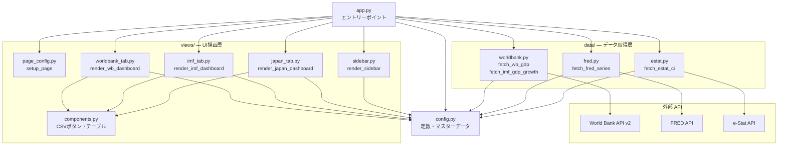
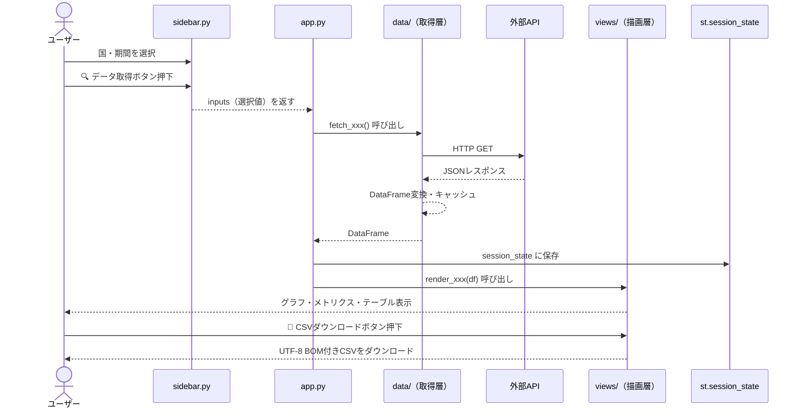

# 各国GDP比較ダッシュボード — 仕様書

## 1. 概要

世界銀行（World Bank）と IMF の2つのデータソースを利用し、各国のGDP関連指標を可視化・比較するStreamlitダッシュボード。
1つのアプリ内に **タブ** で2画面を分離する統合型設計。

| タブ | データソース | 指標 |
|---|---|---|
| 🌍 世界銀行 GDP | World Bank API v2 | GDP（米ドル建て）`NY.GDP.MKTP.CD` |
| 📈 IMF GDP成長率 | IMF Datamapper API | 実質GDP成長率 `NGDP_RPCH` |

---

## 2. 技術スタック

| 項目 | 技術 |
|---|---|
| 言語 | Python 3.10+ |
| フレームワーク | Streamlit |
| データ取得 | `requests` + `pandas` |
| 可視化 | `plotly` |
| パッケージ管理 | `uv` + `pyproject.toml`（仮想環境 `.venv`） |

---

## 3. システム構成（アーキテクチャ）

### 3.1 ディレクトリ構成

```
gdp-dashboard/
├── app.py                  # エントリーポイント・タブ制御・セッション管理
├── config.py               # 全定数・マスターデータ（国コード・APIキー・カラー）
├── pyproject.toml          # 依存パッケージ定義（uv管理）
├── .env                    # APIキー（FRED / e-Stat）
├── data/
│   ├── __init__.py
│   ├── worldbank.py        # fetch_wb_gdp, fetch_imf_gdp_growth
│   ├── fred.py             # fetch_fred_series
│   └── estat.py            # fetch_estat_ci
├── views/
│   ├── __init__.py
│   ├── page_config.py      # setup_page, グローバルCSS
│   ├── sidebar.py          # render_sidebar
│   ├── components.py       # 共通UI部品（CSVボタン・テーブル）
│   ├── worldbank_tab.py    # render_wb_dashboard
│   ├── imf_tab.py          # render_imf_dashboard
│   └── japan_tab.py        # render_japan_dashboard
├── demo_playwright.py      # 自動デモ & 録画スクリプト
└── docs/
    ├── spec.md
    ├── japan_indicators_research.md
    └── prompts.md
```

**設計方針**: データ取得（`data/`）と UI 描画（`views/`）を完全分離。`config.py` に定数を集約し、指標追加時の変更箇所を最小化。

---

### 3.2 モジュール関係図



---

### 3.3 処理フロー概要



---

### 3.4 データキャッシュ戦略

| 関数 | キャッシュ | TTL | 備考 |
|---|---|---|---|
| `fetch_wb_gdp` | `@st.cache_data` | 24h | 引数（国コード・期間）をキーにキャッシュ |
| `fetch_imf_gdp_growth` | `@st.cache_data` | 24h | 引数（国コード・期間）をキーにキャッシュ |
| `fetch_fred_series` | `@st.cache_data` | 24h | シリーズID・期間をキーにキャッシュ |
| `fetch_estat_ci` | `@st.cache_data` | 24h | 引数なし・固定データをキャッシュ |

---

## 4. 画面設計

### 4.1 サイドバー

```
┌─────────────────────────┐
│ ⚙️ ダッシュボード設定      │
│─────────────────────────│
│ 🌍 世界銀行 GDP          │
│  [マルチセレクト: 国選択]   │
│  [スライダー: 期間]       │
│  [🔍 データ取得 ボタン]    │
│─────────────────────────│
│ 📈 IMF GDP成長率         │
│  [マルチセレクト: 国選択]   │
│  [スライダー: 期間]       │
│  [🔍 データ取得 ボタン]    │
└─────────────────────────┘
```

### 4.2 メイン画面

```
┌─────────────────────────────────────────────┐
│ 📊 各国GDP比較ダッシュボード                    │
│                                             │
│ [🌍 世界銀行 GDP] [📈 IMF GDP成長率]  ← タブ   │
│─────────────────────────────────────────────│
│ 📊 主要指標（最新年）                          │
│ ┌──┐ ┌──┐ ┌──┐ ┌──┐ ┌──┐                   │
│ │国1│ │国2│ │国3│ │国4│ │国5│ ← メトリクス    │
│ └──┘ └──┘ └──┘ └──┘ └──┘                   │
│─────────────────────────────────────────────│
│ [Plotly 折れ線グラフ]                          │
│─────────────────────────────────────────────│
│ ▶ 📋 生データを表示  ← エクスパンダー            │
│   [DataFrameテーブル]                         │
└─────────────────────────────────────────────┘
```

---

## 5. 機能要件

### 5.1 世界銀行 GDPタブ

- World Bank API v2 から `NY.GDP.MKTP.CD` を取得
- 国コード: ISO 3166-1 alpha-2（JP, US, CN, DE, IN 等）
- デフォルト選択: 日本, アメリカ, 中国, ドイツ, インド
- 期間スライダー: 1960年〜2023年（デフォルト 2000〜2023）
- キャッシュ: `@st.cache_data(ttl=86400)`
- GDP値は兆ドル単位で表示

### 5.2 IMF GDP成長率タブ

- **World Bank API v2** から `NY.GDP.MKTP.KD.ZG`（実質GDP成長率）を取得
  - ※ IMF Datamapper API が 403 を返すため World Bank に切り替え済み
- 国コード: ISO 3166-1 alpha-3（JPN, USA, CHN, DEU, IND 等）で選択 → 内部で alpha-2 に変換してリクエスト
- デフォルト選択: JPN, USA, CHN, DEU, IND
- 期間スライダー: 1980年〜2029年（デフォルト 2000〜2029）
- キャッシュ: `@st.cache_data(ttl=86400)`
- 成長率は%表示、0%基準線を追加

### 5.3 共通要件

- サイドバーの「データ取得」ボタンを押すまでデータ取得しない
- `st.session_state` でデータを永続化（タブ切替時も保持）
- ネットワークエラー・APIエラー時は `st.error` で通知
- 型ヒント・Docstring を全関数に記述

---

## 6. 実行方法

### 6.1 アプリ起動

```bash
uv run streamlit run app.py
```

依存パッケージは PEP 723 Inline script metadata で宣言済み。`uv run` が自動インストールする。

### 6.2 動作確認

ブラウザで `http://localhost:8501` を開き、サイドバーの「🔍 データ取得」ボタンをクリック。

---

## 7. Playwright 自動デモ & 録画（demo_playwright.py）

### 7.1 概要

`demo_playwright.py` は Streamlit アプリを Playwright で自動操作し、デモ全体を WebM 動画として録画するスクリプト。

### 7.2 前提条件

1. Streamlit アプリが `http://localhost:8501` で起動済み
2. Playwright ブラウザがインストール済み（初回のみ `playwright install chromium`）

### 7.3 実行方法

```bash
# Windows では PYTHONIOENCODING=utf-8 が必須（cp932 での文字化け回避）
$env:PYTHONIOENCODING="utf-8"; uv run --with playwright demo_playwright.py
```

### 7.4 設定パラメータ

| 定数 | デフォルト値 | 説明 |
|---|---|---|
| `APP_URL` | `http://localhost:8501` | 対象 Streamlit URL |
| `RECORDING_DIR` | スクリプトと同じフォルダ | 録画ファイルの出力先 |
| `VIEWPORT_W / H` | `1920 × 1080` | ブラウザの解像度 |
| `SLOW_MO` | `300 ms` | 操作間のディレイ（デモを見やすくする） |

### 7.5 デモシナリオ（8ステップ）

| ステップ | 操作 |
|---|---|
| 1 | アプリを開き、Streamlit のロード完了を待つ |
| 2 | 世界銀行「🔍 データ取得」ボタンをクリック → Plotly チャート待機 |
| 3 | スムーズスクロールでグラフを閲覧 |
| 4 | 「📋 生データを表示」エクスパンダーを展開 |
| 5 | ページトップに戻る |
| 6 | IMF タブに切り替え |
| 7 | サイドバーをスクロールして IMF「🔍 データ取得」ボタンをクリック |
| 8 | IMF グラフ・テーブルを閲覧し終了 |

### 7.6 出力

- **録画ファイル**: `d:\streamlit例\*.webm`（コンテキスト close 時に自動保存）
- ファイル名は Playwright が自動生成するハッシュ形式（例: `page@xxxx.webm`）

---

## 8. エラーハンドリング

| 状況 | 挙動 |
|---|---|
| 国を選択せずにデータ取得ボタンを押す | `st.toast` で警告を表示、データ取得はスキップ |
| ネットワーク接続エラー | `RuntimeError` を捕捉し `st.error` で表示 |
| API タイムアウト（30 秒） | `RuntimeError` を捕捉し `st.error` で表示 |
| API が空データを返す | `RuntimeError` を捕捉し `st.error` で表示 |
| Playwright でエクスパンダーが見つからない | `except Exception` でスキップし続行 |
